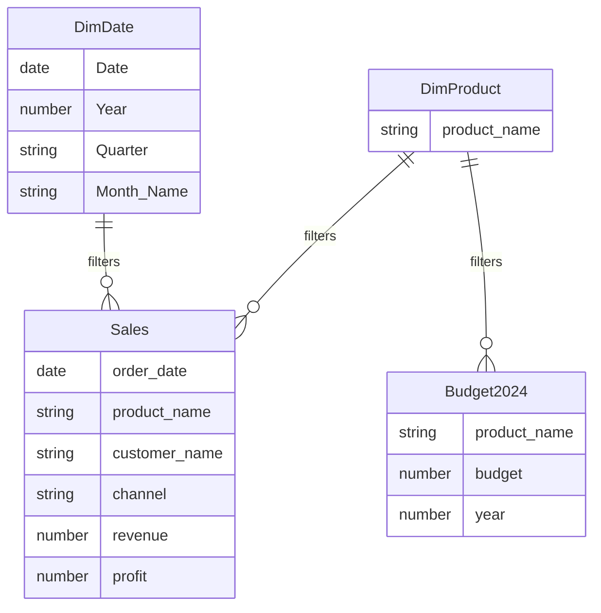

# GeoInsights: Regional Sales Analytics & BI Dashboard

> An end-to-end data analytics project that transforms multi-sheet regional sales data into a validated analytical dataset, a dimensional Power BI model, and decision-ready business insights across revenue, profitability, products, channels, customers, and U.S. geography.

**Analysis period:** 2021–2024  
**Tech stack:** Python · Pandas · NumPy · Power BI · DAX · Excel  
**Project by:** Rahul Kumar

---

## Project Overview

GeoInsights was built to answer a practical business question:

**Where is the business generating revenue and profit, what is driving performance, and where should management focus next?**

The project covers the complete analytics workflow—from raw Excel ingestion and data-quality validation in Python to feature engineering, dimensional modelling, DAX measures, interactive Power BI dashboards, and business recommendations.

The final report contains a navigation page plus three analytical dashboards:

1. **Executive Overview & Trends** — revenue, profitability, seasonality, and transaction behaviour.
2. **Product & Channel Performance** — product rankings, channel mix, revenue, and margin performance.
3. **Geographic & Customer Insights** — customer, state, and U.S. regional performance.

### Project files

- [Data Wrangling Notebook](datawrangling.ipynb)
- [Power BI Dashboard — PDF](GeoInsights_Dashboard_Complete.pdf)
- [Final Project Presentation](GeoInsights%20Presentation%20Final.pptx)

---

## Business Problem & Objectives

Sales performance varies across products, channels, customers, and geographic markets. Without a consolidated analytical view, it is difficult to determine which areas drive revenue, which deliver stronger profitability, and where growth opportunities or concentration risks exist.

The analysis was designed to:

- identify the products, customers, channels, states, and regions driving revenue and profitability;
- uncover monthly seasonality and transaction-value patterns;
- evaluate pricing, cost, profit, and margin behaviour;
- structure the 2024 product budget separately for planning analysis;
- build an interactive Power BI solution for business decision-making.

---

## Data at a Glance

| Item | Scope |
|---|---:|
| Raw sales rows | 64,104 |
| Final 2021–2024 analytical transactions | **61,626** |
| Final analytical columns | 23 |
| Products | 30 |
| Customers | 175 |
| Channels | Wholesale, Distributor, Export |
| Geographic coverage | U.S. cities, states, and regions |
| Analysis period | 2021–2024 |
| 2024 budget products | 30 |

The source workbook contains six worksheets: **Sales Orders, Customers, Products, Regions, State Regions, and 2024 Budgets**.

---

## Data Wrangling & Quality Controls

The raw data was profiled and cleaned in Python/Pandas before it entered Power BI.

Key controls included:

- checked every source table for missing values — **0 missing values** were found in the raw worksheets;
- checked exact duplicate rows — **0 duplicates** were found across the source tables;
- detected **36 invalid `29-02-2023` dates**;
- corrected those records to **2023-02-28** using the documented assumption that they represented the end of February;
- converted the cleaned order date to a true datetime field and revalidated missing dates;
- merged customer, product, geographic, and U.S. region reference data using validated `many_to_one` joins;
- confirmed **0 unmatched products, regions, and U.S. regions** after mapping;
- removed redundant technical merge columns and standardized analytical field names;
- restricted the final analytical dataset to **2021–2024**, producing **61,626 rows × 23 columns**.

The 2024 product budget was intentionally retained as a **separate table** instead of being repeated at transaction level, preserving the correct data grain.

---

## Feature Engineering & Metric Logic

Python was used to create analysis-ready time and profitability features.

| Feature | Logic / Purpose |
|---|---|
| `order_year` | Year extracted from `order_date` |
| `order_quarter` | Calendar quarter (`Q1`–`Q4`) |
| `order_month_name` | Month label for reporting |
| `order_month_num` | Numeric month for chronological sorting |
| `total_cost` | `quantity × unit_cost` |
| `profit` | `revenue − total_cost` |
| `profit_margin_percentage` | `(profit / revenue) × 100` when revenue is non-zero |

The notebook exports two analysis-ready datasets:

- `geoinsights_sales_2021_2024.csv`
- `product_budget_2024.csv`

---

## Power BI Data Model

The Power BI solution uses a compact dimensional model rather than relying on one flat reporting table.



Model design highlights:

- `Sales` is the main fact table.
- `DimDate` supports chronological filtering and time analysis.
- `DimProduct` provides a shared product dimension for actual sales and budget data.
- `Budget2024` remains at product-level planning grain.
- relationships use single-direction filtering.
- a dedicated `_Measures` table keeps DAX measures organized.

---

## Core DAX Measures

```DAX
Total Revenue =
SUM(Sales[revenue])

Total Profit =
SUM(Sales[profit])

Profit Margin % =
DIVIDE([Total Profit], [Total Revenue], 0)

Transaction Count =
COUNTROWS(Sales)
```

Using `Total Profit / Total Revenue` for the headline margin gives a **revenue-weighted business margin**, rather than averaging row-level percentages.

---

## Executive KPI Snapshot

| KPI | Result |
|---|---:|
| **Total Revenue** | **$1.19B** |
| **Total Profit** | **$443.92M** |
| **Profit Margin** | **37.37%** |
| **Transaction Count** | **61,626** |

---

## Dashboard 1 — Executive Overview & Trends

**Purpose:** provide a fast view of overall business health, seasonality, transaction behaviour, and product-level price/margin patterns.

**Slicers:** Year · Channel · U.S. Region

### Visuals

- **Monthly Revenue Seasonality**
- **Monthly Profit Contribution**
- **Transaction Value Distribution**
- **Average Unit Price vs Profit Margin by Product**

### Key findings

- **May** is the strongest aggregated revenue month at approximately **$102.27M**.
- **February** is the weakest at approximately **$91.30M**.
- monthly profit contribution remains comparatively stable; **December contributes about $38.1M**, among the strongest months.
- transaction values are **right-skewed**: most transactions fall in lower-value ranges while relatively few transactions form the high-value tail.
- most products cluster around roughly **36–39% profit margin**, suggesting that price differences do not translate proportionally into margin differences.

---

## Dashboard 2 — Product & Channel Performance

**Purpose:** identify the products and sales channels creating scale and profitability.

**Slicers:** Year · Product · Channel

### Visuals

- Top 10 Products by Revenue
- Top 10 Products by Profit Margin
- Revenue vs Profit — Top 10 Products
- Profit Share by Channel
- Revenue & Profit by Channel
- Profit Margin by Channel

### Key findings

- **Product 26** leads product revenue at approximately **$112.45M**.
- **Product 25** follows at approximately **$105.72M**.
- **Product 9** records the highest displayed product profit margin at **40.12%**.
- higher-revenue products generally generate higher absolute profit; Product 26 leads both revenue and profit among the displayed products.
- **Wholesale** is the scale engine with approximately **$642M revenue** and **$238M profit**, contributing about **53.59%** of total profit.
- **Export** is smaller in absolute contribution but has the **highest channel margin at 38.03%**, versus Distributor at **37.64%** and Wholesale at **37.04%**.

**Business interpretation:** Wholesale drives scale, while Export shows stronger margin efficiency.

---

## Dashboard 3 — Geographic & Customer Insights

**Purpose:** understand where revenue and profit are concentrated and distinguish high-revenue customers from high-margin customers.

**Slicers:** Year · U.S. Region · State

### Visuals

- Top 10 Customers by Revenue
- Top 10 Customers by Profit Margin
- Top 10 States by Revenue
- Revenue Share by U.S. Region
- Profit Margin by U.S. Region
- Profit Distribution by State

### Key findings

- **Aibox Company** leads customer revenue at **$12.16M**, followed by **State Ltd at $11.85M** and **Pixoboo Corp at about $10.65M**.
- **Neutrogena Ltd** leads customer profit margin at **44.59%**, followed by **Avamba Company at 44.32%**.
- **California** dominates state revenue at approximately **$220.26M**, more than twice Illinois at **$107.13M**.
- regional revenue share is led by the **West: $357.99M (30.14%)**, followed by the South, Midwest, and Northeast.
- regional margins are remarkably close: **37.06%–37.47%** across the four U.S. regions.
- the Top 10 customers contribute only about **8.84% of total revenue**, indicating relatively diversified customer exposure.

**Business interpretation:** geographic revenue differences are driven primarily by market scale and penetration rather than large differences in margin efficiency.

---

## Key Business Insights

1. **Seasonality matters, but the business is relatively stable.** February underperforms while May is the strongest month, creating a clear planning signal without extreme month-to-month volatility.
2. **Product leadership is concentrated but not excessive.** Products 26 and 25 are the strongest revenue contributors, while Product 9 stands out for margin performance.
3. **Scale and efficiency come from different channels.** Wholesale contributes the most revenue and profit; Export delivers the strongest margin percentage.
4. **California and the West are major growth anchors.** California is the dominant state and the West is the leading U.S. region by revenue.
5. **Regional profitability is highly consistent.** Similar margins across regions suggest that expanding volume and market penetration may matter more than regional repricing.
6. **Customer exposure is diversified.** The Top 10 customers account for only about 8.84% of revenue, reducing dependence on a small number of accounts.

---

## Business Recommendations

- **Optimize seasonal planning:** strengthen promotions and pipeline activity around weaker February performance while preparing inventory and capacity for stronger months.
- **Protect product leaders:** maintain momentum for Products 26 and 25 and investigate Product 9's higher-margin characteristics for product-mix and pricing opportunities.
- **Balance channel strategy:** retain Wholesale as the scale engine while exploring profitable expansion opportunities in Export.
- **Expand geographic opportunity:** study the California/West playbook and test transferable demand drivers in lower-revenue markets, particularly the Northeast.
- **Segment customer actions:** protect high-revenue accounts while targeting high-margin customers for cross-sell and upsell opportunities.
- **Monitor pricing/margin outliers:** use the price-vs-margin scatter to investigate products whose pricing and profitability behaviour differs from the main cluster.

---

## End-to-End Workflow


---

## Tools & Skills Demonstrated

| Area | Tools / Techniques |
|---|---|
| Data ingestion | Excel, Pandas |
| Data quality | null checks, duplicate checks, invalid-date detection, mapping validation |
| Data wrangling | joins, column standardization, type conversion, scope filtering |
| Feature engineering | time features, cost, profit, profit margin |
| Data modelling | fact/dimension design, relationship management, dedicated measure table |
| Business intelligence | Power BI, slicers, Top N analysis, histograms, scatter plots, treemaps, waterfall charts |
| Measures | DAX, weighted profitability logic |
| Business analysis | seasonality, channel mix, product ranking, geographic and customer performance |
| Communication | dashboard storytelling, findings, recommendations, executive presentation |

---

## How to Explore the Project

1. Start with the [Data Wrangling Notebook](datawrangling.ipynb) to review data ingestion, cleaning, validation, and feature engineering.
2. Open the [Power BI Dashboard PDF](GeoInsights_Dashboard_Complete.pdf) for the complete four-page report snapshot.
3. Review the [Final Presentation](GeoInsights%20Presentation%20Final.pptx) for the business narrative, findings, and recommendations.
4. If using the live Power BI report, interact with the Year, Product/Channel, Region, and State slicers to explore performance dynamically.

---

## Data & Modelling Notes

- `order_number` is an order reference and is **not treated as the analytical transaction counter**; the report uses row-level transaction grain and `COUNTROWS(Sales)`.
- the invalid `29-02-2023` dates were corrected only after documenting the end-of-February assumption.
- budget data is kept separate from transaction-level Sales to prevent accidental repetition of product budgets across sales rows.
- the final dashboard scope is **2021–2024**, even though the raw source extends beyond that analysis period.
- dashboard profit margin is calculated as **Total Profit ÷ Total Revenue**, which is appropriate for aggregate business reporting.

---

## Project Outcome

GeoInsights converts fragmented operational data into a structured analytics solution that answers four management questions:

- **How is the business performing overall?**
- **Which products and channels create the most value?**
- **Where are the strongest markets and customers?**
- **What actions can improve growth, mix, and decision-making?**

The result is a portfolio-ready demonstration of the full analyst workflow: **data quality → transformation → modelling → DAX → visualization → insight → recommendation**.

---

## Author

**Rahul Kumar**  
Data Analytics Portfolio Project

If you found this project useful, consider starring the repository.
